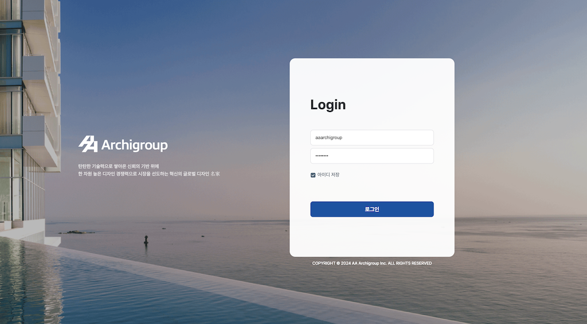
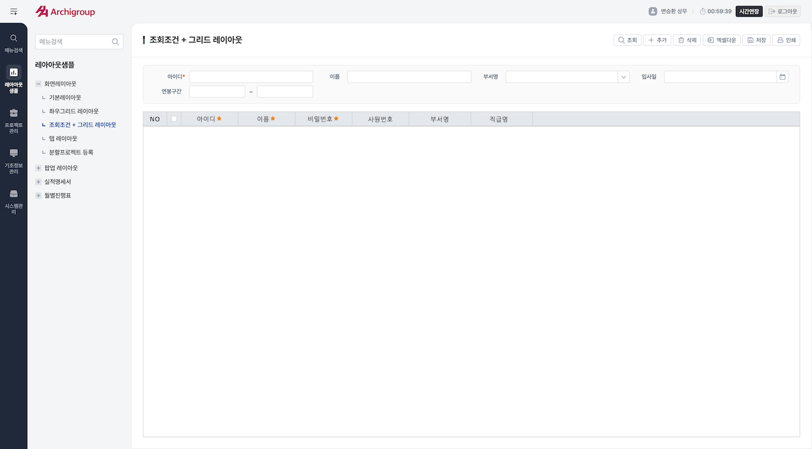

  

# AA Archigroup PIMS Front-end Project (2025)

 

  
  
  

  

## Design System 🎨

 

  
  Figma: <a href="https://www.figma.com/design/hxiASdNhuQS23DVszS7N7d/PIMS_web_design" target="_blank">AA Archigroup Design</a>

 

  
  Storybook: <a href="https://aaarch.storybook.ntils.com/" target="_blank">AA Archigroup PIMS Storybook</a>

  

## Test Pages 🧪

 

- Login: [로그인 페이지](https://aaarch.ntils.com/login.html)   
- Main: [메인 페이지](https://aaarch.ntils.com)

  

## Latest Release 🚀
[최종 버전 릴리스](https://github.com/hwigyeom/aa_archigroup_front/releases/latest)
